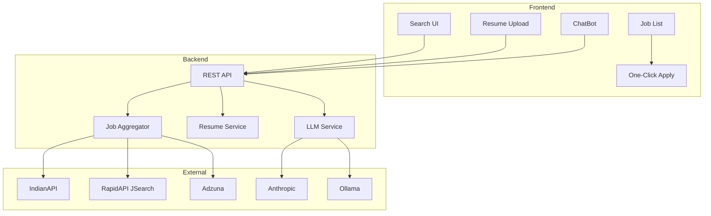
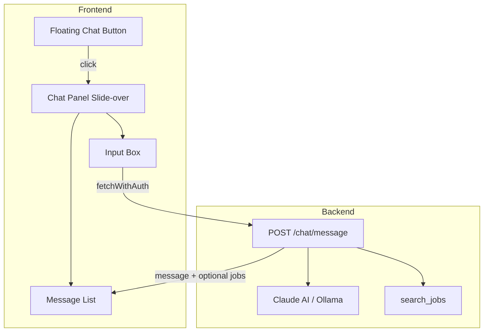

# ApplyFlow — Project Planning

Sab plans ek jagah. Consolidated from: Job Apply Bot, Chatbot, Ollama LLM Support.

---

## 1. Project Overview

**ApplyFlow** — Smart job search: multi-platform aggregation, AI-powered resume parsing, cover letters, match scores, application tracking, chatbot. India + international.

### Tech Stack

| Layer     | Stack                              |
| --------- | ---------------------------------- |
| Frontend  | React, Vite, Tailwind              |
| Backend   | FastAPI, SQLite                    |
| AI        | Anthropic Claude + Ollama (fallback) |
| Job APIs  | JSearch, Adzuna, IndianAPI        |

---

## 2. Architecture

### Overall System



### Chatbot Architecture (Detail)



---

## 3. Core Features

### Job Search

- **15 profiles**: Data Scientist, AI Engineer, Frontend, Backend, Full Stack, DevOps, Mobile, Data Engineer, Cloud, Software Engineer, Product Manager, QA, UI/UX, Business Analyst
- **Filters**: Location, posted (24h, 3d, 7d, 14d, 30d), experience, job type, salary
- **Sources**: IndianAPI, RapidAPI JSearch, Adzuna (merge + dedupe)
- **Mock fallback**: Demo jobs when no API keys
- **In-memory cache**: 15 min TTL for same search
- **Debounce**: 300ms on search input

### Resume Management

- PDF/DOCX upload
- LLM parsing: name, email, phone, skills, experience, education
- Match score (1–10) vs job description
- Cover letter generation (3–4 paragraphs)
- Resume tips (4–6 bullets per job)
- Job summary (2–3 lines)
- Local storage + DB metadata

### Application Tracking

- **Saved for later**: Bookmark jobs (Applied se alag)
- **Status**: Applied / Interview / Rejected
- CSV export
- Status filter in Applied tab

### UI

- Dark mode, sort (newest, oldest, company A–Z)
- Job detail page (`/app/job/:externalId`)
- Modals: Cover letter, Resume tips
- Skeleton loaders, empty states, toasts
- Keyboard: `/` = search focus, `Esc` = modal close

---

## 4. Chatbot (Full Plan)

### Backend: Chat API

**File**: `backend/app/api/chat.py`

- **Endpoint**: `POST /chat/message`
- **Auth**: `get_current_user` (required)
- **Request**: `{ "message": string, "history": [{ "role": "user"|"assistant", "content": string }]? }`
- **Response**: `{ "reply": string, "jobs": Job[]? }`

**Logic**:

1. Detect job-search intent via keywords (jobs, find, search, hiring, role names, "in [city]").
2. If job-search: parse role/location from message; call `search_jobs()`; inject top 5–10 jobs into LLM context.
3. Build prompt: System ("You are ApplyFlow assistant..."), resume context (GET /resume), job results.
4. Call `chat_reply()` — Anthropic first, then Ollama fallback.
5. Rate limit: `@limiter.limit("30/minute")`.
6. Return `{ reply, jobs }` — `jobs` only when it was a job-search query.

### Service: `chat_reply()` in claude_service.py

- Accept `messages`, `job_context`, `resume_context`.
- Try Anthropic → Ollama → fallback.
- Fallback: "I'm having trouble right now" + any job results we have.

### Register Router in main.py

```python
from app.api.chat import router as chat_router
app.include_router(chat_router)
```

### Frontend: Chat UI

**File**: `frontend/src/components/ChatBot.jsx`

| Element | Detail |
| ------- | ------ |
| **Floating button** | Bottom-right, fixed, `MessageCircle` icon, accent color, z-[55] |
| **Panel** | Slide-over from right, max-w-md, full-width on mobile |
| **Header** | "ApplyFlow Assistant" + close button |
| **Content** | Message list (user + assistant bubbles), Input + Send |
| **State** | `open`, `messages`, `loading`, `inputValue` |
| **API** | `fetchWithAuth(POST /chat/message)` with `{ message, history }` |
| **Job cards** | Compact: title, company, View link, Apply link (when `jobs` present) |
| **Styling** | `border-stone-200`, `bg-[var(--surface)]`, `var(--accent)` |

**Integration**: Render `<ChatBot />` inside `ProtectedRoute` in `main.jsx` (global overlay, no new route).

### Job-Search Intent Parsing

**Triggers**: job, jobs, find, search, hiring, openings, role names (Data Scientist, Frontend, etc.), "in Bangalore", "at Mumbai".

**Mapping**: Phrases → `JOB_PROFILES` ids (e.g. "data scientist" → `data_scientist`).

**Location**: Patterns like "in X", "at X".

**Default**: `profiles=["software_engineer"]`, `location=""` if unclear.

### Data Flow (Job Search via Chat)

1. User: "Show me Data Scientist jobs in Bangalore"
2. Backend: Detects intent → `search_jobs(profiles=["data_scientist"], location="Bangalore")`
3. Backend: Injects job list into LLM prompt
4. LLM: Returns friendly summary + "Here are 5 jobs..."
5. Backend: Returns `{ reply: "...", jobs: [...] }`
6. Frontend: Renders assistant message; below it, compact job cards with Apply link

### Chat Files to Create/Modify

| Action | File |
| ------ | ---- |
| Create | `backend/app/api/chat.py` — router, intent parsing, API handler |
| Modify | `backend/app/services/claude_service.py` — add `chat_reply()` |
| Modify | `backend/app/main.py` — include chat router |
| Create | `frontend/src/components/ChatBot.jsx` — floating button + slide-over panel |
| Modify | `frontend/src/main.jsx` — render ChatBot inside ProtectedRoute |

### Chat Edge Cases

- No ANTHROPIC_API_KEY: Fallback to Ollama; still return jobs if fetched.
- Empty job results: LLM says "No jobs found for that criteria" with suggestions.
- Long conversations: Truncate history to last 10 messages.
- Mobile: Panel full-width on small screens.

---

## 5. LLM: Anthropic + Ollama Fallback

### Feature Comparison

| Feature | Claude (Anthropic) | Ollama |
| ------- | ------------------ | ------ |
| Resume parsing (JSON) | Strong | Good (llama3.2, mistral, qwen2.5) |
| Job summary | Strong | Good |
| Match score | Strong | Good; has `_skills_overlap_score` fallback |
| Cover letter | Strong | Good (7B+ models) |
| Resume tips | Strong | Good |
| Chatbot | Strong | Good |
| Cost | Paid | Free (local) |
| API key | Required | None |
| Privacy | Data to Anthropic | Data stays local |
| Offline | No | Yes |

### Fallback Chain

1. If `ANTHROPIC_API_KEY` set → try Anthropic first
2. On failure (401, network) or no key → try Ollama
3. If both fail → fallbacks (keyword tips, "I'm having trouble")

### Implementation

**claude_service.py**:

- `_call_anthropic(prompt, max_tokens)` — returns `None` on error
- `_call_ollama(prompt, max_tokens)` — `openai.OpenAI(base_url=..., api_key="ollama")` with `OLLAMA_MODEL`
- `_call_llm(prompt, max_tokens)` — try Anthropic → Ollama → `None`
- Same for `chat_reply`: `_chat_reply_anthropic`, `_chat_reply_ollama`

**Dependencies**: `openai>=1.0` in requirements.txt

### Env Variables

| Variable | Description |
| -------- | ----------- |
| `ANTHROPIC_API_KEY` | Optional; Ollama used when unset/fail |
| `OLLAMA_BASE_URL` | Default `http://localhost:11434/v1` |
| `OLLAMA_MODEL` | Default `llama3.2` |

### Ollama Files Changed

| File | Changes |
| ---- | ------- |
| claude_service.py | `_call_ollama`, `_call_anthropic`, `_call_llm`; `chat_reply` fallback |
| requirements.txt | Add `openai>=1.0` |
| .env.example | Add `OLLAMA_BASE_URL`, `OLLAMA_MODEL` |
| README.md | Document fallback + Ollama setup |

### LLM Edge Cases

- No key, no Ollama: Returns fallback (same as today).
- Key set, Anthropic fails: Falls back to Ollama.
- Ollama not running: If Anthropic also failed, return fallback.

---

## 6. Design System

### Typography

| Role | Font |
| ---- | ---- |
| Headings | Instrument Serif |
| Body | DM Sans |
| Mono | JetBrains Mono |

### Colors

**Light**: `--bg: #FAFAF9`, `--surface: #FFFFFF`, `--primary: #0F172A`, `--accent: #EA580C`, `--secondary: #64748B`, Success `#16A34A`, Error `#DC2626`, Interview `#2563EB`

**Dark**: `--bg: #0C0A09`, `--surface: #1C1917`, `--primary: #FAFAF9`, `--accent: #F97316`

### Layout

- Asymmetric: sidebar 1/3, main 2/3
- Mobile: single column, full-width chat panel

### Component Touches

| Component | Detail |
| --------- | ------ |
| Job card | Left border accent by match score; hover lift |
| Profile chips | Pill shape, selected = filled accent |
| Search bar | Monospace placeholder, focus ring accent |
| Match score | Circular 1–10, color: red &lt; 4, amber 4–7, green 7+ |
| Modals | Backdrop blur, rounded-2xl, slide-up |
| Dark toggle | Sun/moon with 180deg rotate |

---

## 7. Project Structure

```
Apply_job_bot/
├── backend/
│   ├── app/
│   │   ├── main.py
│   │   ├── api/
│   │   │   ├── auth.py
│   │   │   ├── chat.py
│   │   │   ├── jobs.py
│   │   │   ├── resume.py
│   │   │   └── apply.py
│   │   ├── services/
│   │   │   ├── job_aggregator.py
│   │   │   ├── resume_service.py
│   │   │   └── claude_service.py
│   │   ├── config/
│   │   │   └── job_profiles.py
│   │   ├── models/
│   │   └── limiter.py
│   └── requirements.txt
├── frontend/
│   ├── src/
│   │   ├── components/
│   │   │   ├── ChatBot.jsx
│   │   │   ├── JobCard.jsx
│   │   │   ├── ProfileFilter.jsx
│   │   │   ├── Filters.jsx
│   │   │   ├── ResumeUpload.jsx
│   │   │   ├── AppliedJobs.jsx
│   │   │   ├── SavedJobs.jsx
│   │   │   ├── CoverLetterModal.jsx
│   │   │   ├── ResumeTipsModal.jsx
│   │   │   └── ThemeToggle.jsx
│   │   ├── contexts/
│   │   │   └── AuthContext.jsx
│   │   ├── pages/
│   │   ├── App.jsx
│   │   └── main.jsx
│   └── package.json
├── .env.example
├── PLANNING.md
└── README.md
```

---

## 8. API Endpoints

| Method | Endpoint | Description |
| ------ | -------- | ----------- |
| GET | `/jobs/profiles` | All job profiles + experience levels |
| GET | `/jobs/search` | Search — profiles, q, location, posted, type, experience |
| GET | `/jobs/detail/{external_id}` | Full job by external_id |
| POST | `/jobs/summary` | LLM — 2-line job summary |
| POST | `/jobs/match-score` | LLM — resume vs job 1–10 |
| POST | `/jobs/cover-letter` | LLM — cover letter draft |
| POST | `/jobs/resume-tips` | LLM — skills to highlight |
| POST | `/jobs/apply` | Track apply, open apply URL |
| POST | `/jobs/save` | Save job (bookmark) |
| DELETE | `/jobs/save` | Unsave job |
| GET | `/jobs/applied` | Applied jobs (status filter) |
| GET | `/jobs/applied/export` | Export CSV |
| GET | `/jobs/saved` | Saved jobs |
| POST | `/chat/message` | Chat with job search |
| POST | `/resume/upload` | Upload resume |
| GET | `/resume` | Get resume metadata |

---

## 9. Auth & Session

- JWT auth
- `sessionStorage` — logout on tab close
- 5-min inactivity auto-logout
- Google OAuth optional
- Password reset (SMTP or dev log)

---

## 10. Environment Variables

```
ANTHROPIC_API_KEY=
OLLAMA_BASE_URL=http://localhost:11434/v1
OLLAMA_MODEL=llama3.2
INDIANAPI_KEY=
RAPIDAPI_KEY=
ADZUNA_APP_ID=
ADZUNA_APP_KEY=
DATABASE_URL=sqlite:///./apply_job_bot.db
JWT_SECRET=
CORS_ORIGINS=
SERVE_FRONTEND=false
```

---

## 11. Implementation Phases (Reference)

1. Backend + Job APIs
2. Resume + LLM core
3. LLM features (summary, match, cover letter, tips)
4. Application tracking + CSV
5. Frontend (all components)
6. Chatbot
7. Ollama fallback
8. Polish (skeletons, toasts, shortcuts)

---

*Consolidated from: Job Apply Bot App, ApplyFlow Chatbot, Ollama LLM Support plans.*
